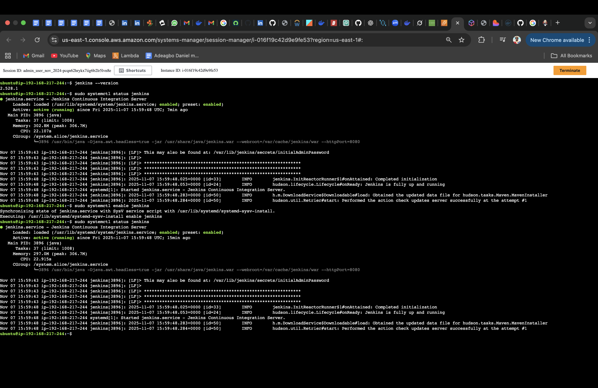
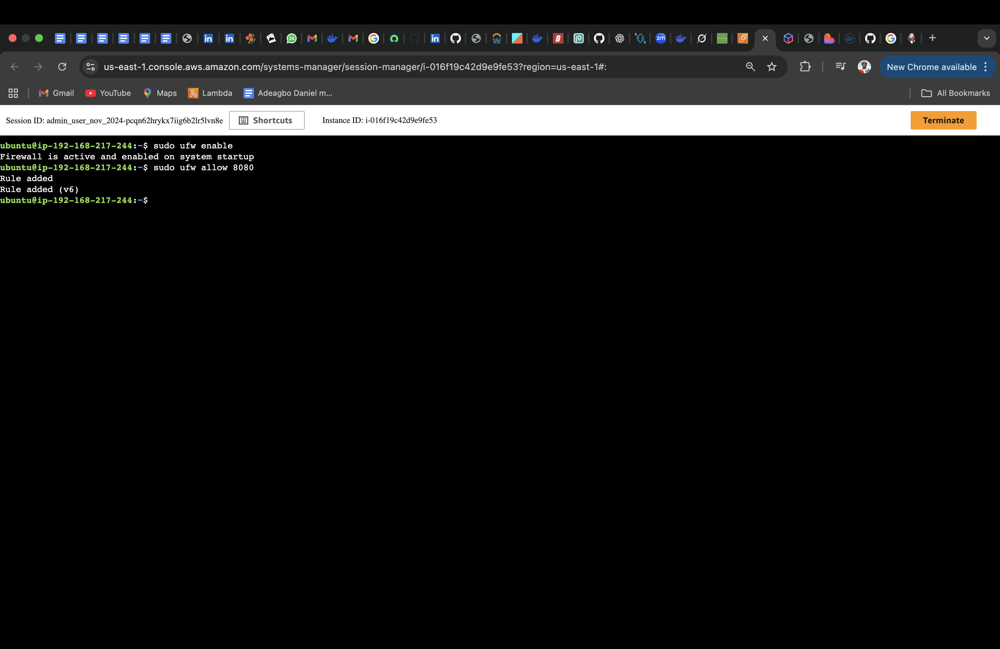
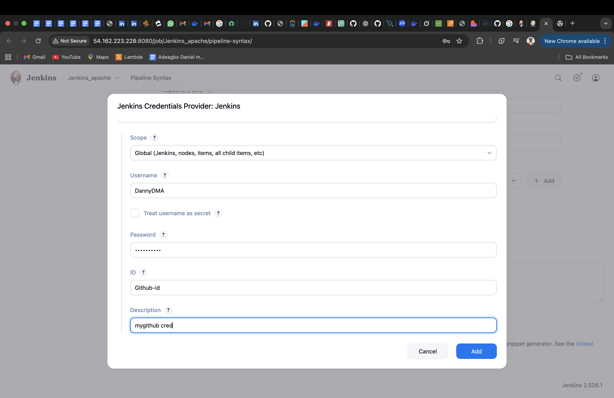
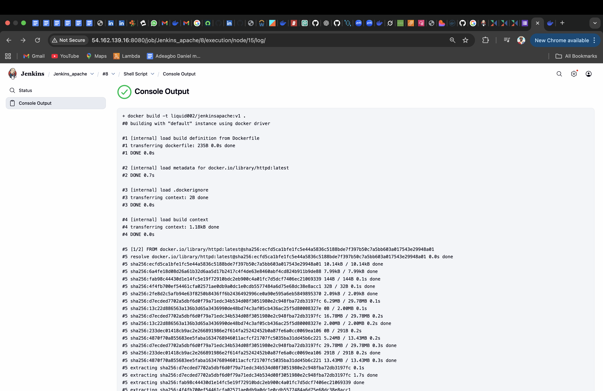
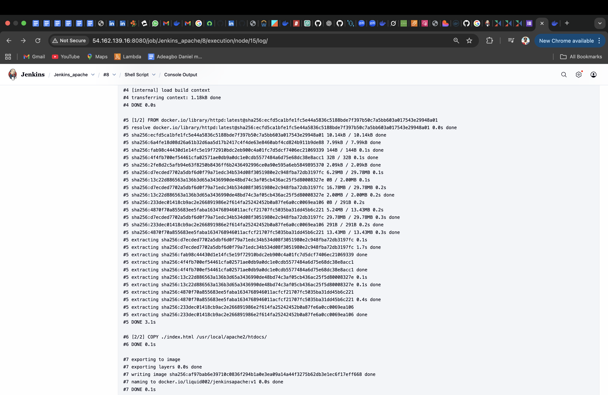
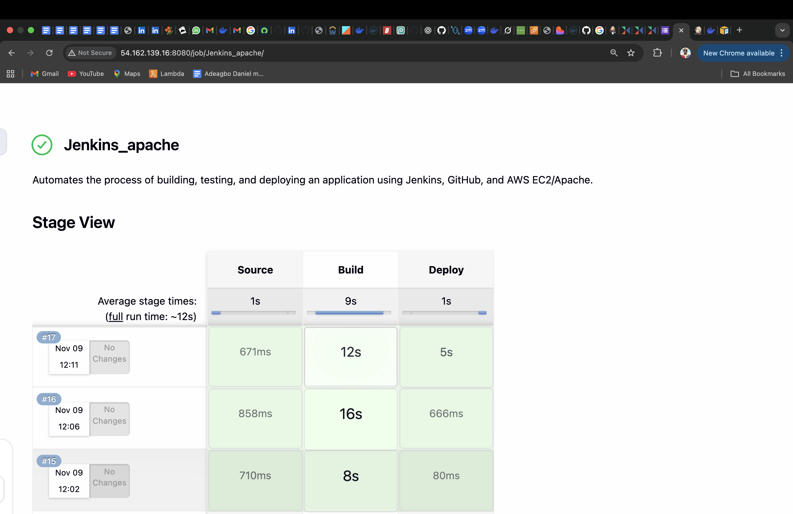
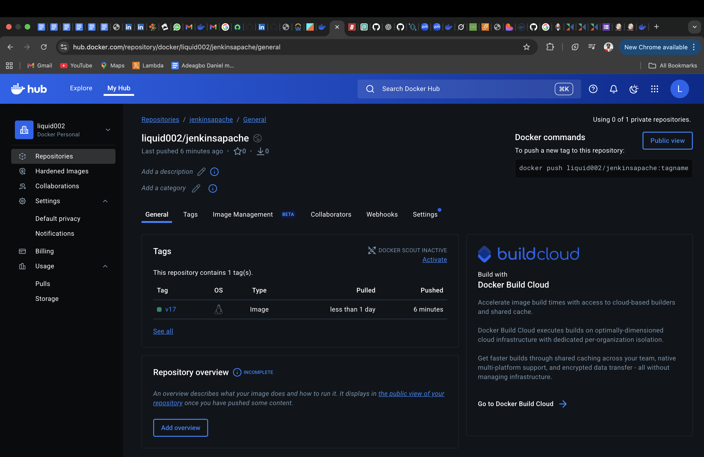

# Jenkins CI/CD Pipeline Project
 
This project demonstrates how to set up and automate a Continuous Integration and Continuous Deployment (CI/CD) pipeline using Jenkins.
It builds, tests, and deploys a sample web application automatically through Jenkins stages — integrating GitHub, Docker, and DockerHub.

# The pipeline eliminates manual steps in development and ensures consistent, repeatable builds across environments.
[]

# Steps
**Before starting**

Ubuntu or Amazon Linux EC2 instance
---
Jenkins installed and running on port 8080
---
Docker installed and configured
---
Port 8080 open in your firewall/security group
---
GitHub repository created
---
DockerHub account created
---

1. Install Jenkins and Enable port 8080 on host firewall
[]

[]
---

2. Clone github repository to Jenkins
[]
---

3. Build Image
[]
[]
---

4. Push Image to DockerHub
[]
[]

# **Summary**
This Jenkins CI/CD project automates the build, test, and deployment process of a web application using Jenkins pipelines. It integrates seamlessly with GitHub for source control and DockerHub for container image management.

The pipeline is designed to automatically:

Fetch the source code from GitHub

Build a Docker image

Push the image to DockerHub

By implementing Jenkins automation, the project ensures faster delivery, consistent deployments, and improved DevOps efficiency. It demonstrates the use of:

Jenkins pipelines (Declarative syntax)

Secure credentials management in Jenkins

Integration between Jenkins, Docker, and GitHub

This setup serves as a foundation for scalable CI/CD automation in cloud environments like AWS EC2, supporting real-world deployment scenarios and continuous delivery best practices.